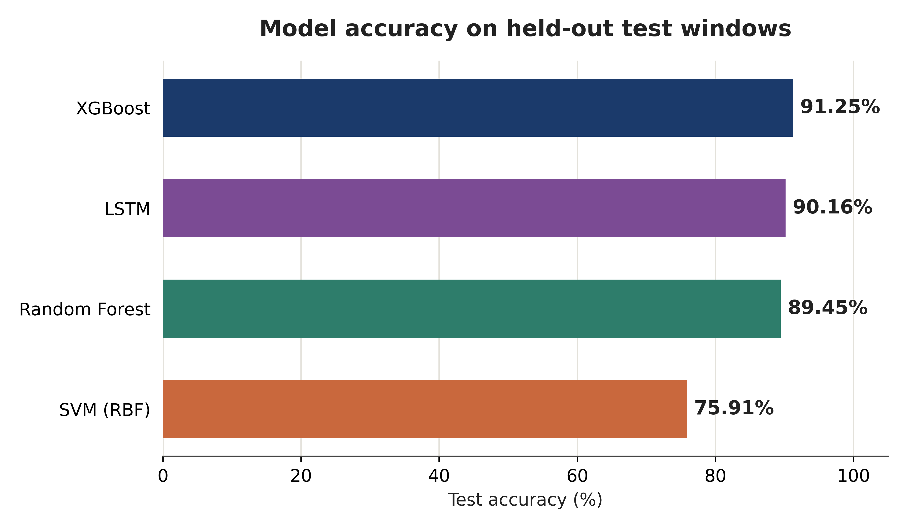
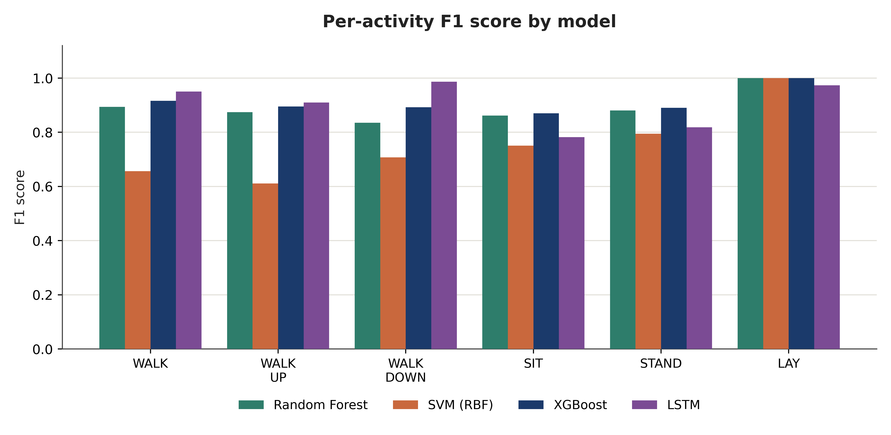
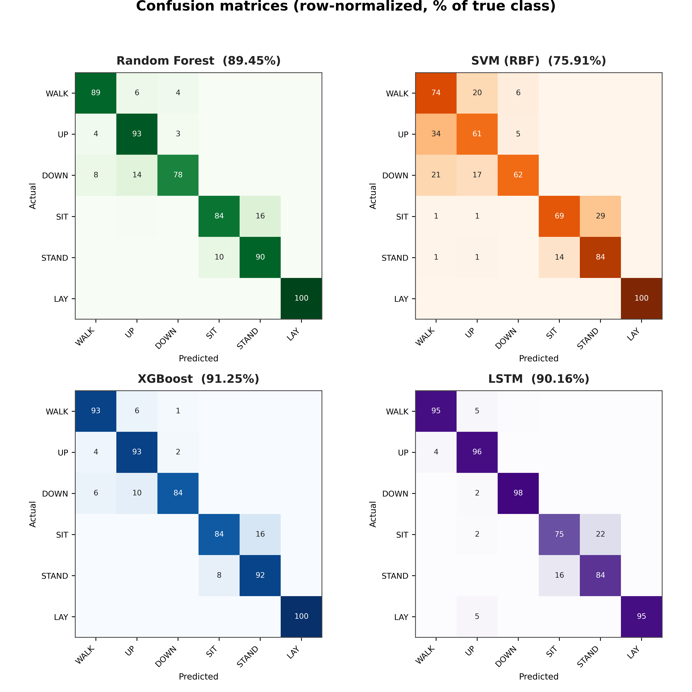

# From Raw IMU Signal to Activity Recognition

Comparing hand-crafted features and learned representations for human activity recognition from raw smartphone sensor data.

## Overview

This project builds a complete pipeline that turns raw accelerometer/gyroscope signal into predicted human activity (walking, walking upstairs, walking downstairs, sitting, standing, lying), and compares two fundamentally different strategies for doing so:

1. **Hand-crafted features + classical ML** — 72 engineered time- and frequency-domain features per window, fed into Random Forest, SVM, and XGBoost.
2. **Learned representations** — an LSTM trained directly on raw sensor windows, with no manual feature design at all.

The goal was to find out whether a model with zero domain knowledge could recover, from raw data alone, the same predictive signal that careful feature engineering captures explicitly — and to quantify the trade-offs (accuracy, training cost, interpretability) between the two approaches.

## Dataset

[UCI Human Activity Recognition Using Smartphones](https://archive.ics.uci.edu/dataset/240/human+activity+recognition+using+smartphones) — 30 subjects, 6 activities, waist-mounted smartphone, 50 Hz sampling, 2.56s windows (128 readings) with 50% overlap, 9 raw channels (body acceleration, body gyroscope, total acceleration × x/y/z). 10,299 windows total, split by subject into 7,352 train / 2,947 test.

The dataset's pre-computed 561-feature representation was **not used**. All 72 features in this project were engineered from the raw `Inertial Signals` files, so the entire pipeline — from unprocessed sensor readings to a trained classifier — was built independently.

## Pipeline

```
RAW SIGNAL (128×9)  →  72 hand-crafted features  →  Random Forest / SVM / XGBoost  →  activity
RAW SIGNAL (128×9)  →  LSTM (64 units)            →  activity
```

**Feature engineering:** per channel, 8 statistics — mean, std, min, max, RMS, zero-crossing rate, spectral energy, dominant FFT frequency index (8 × 9 = 72 features/window).

**Classical models:** Random Forest (200 trees), SVM (RBF kernel, C=10), XGBoost (300 rounds) — default/lightly-tuned hyperparameters, since the goal was comparing paradigms, not exhaustive tuning.

**LSTM:** 1 layer × 64 units → dropout → dense softmax(6), trained 20 epochs, Adam optimizer, batch size 64, directly on raw windows.

## Results

| Model | Accuracy | Macro F1 | Train time |
|---|---|---|---|
| **XGBoost** (300 rounds) | **91.25%** | 0.911 | 2.86 s |
| LSTM (raw windows) | 90.16% | 0.904 | 182.46 s |
| Random Forest (200 trees) | 89.45% | 0.891 | 0.89 s |
| SVM — RBF kernel (C=10) | 75.91% | 0.754 | 0.33 s |



XGBoost and the LSTM finish within **one accuracy point of each other**, despite the LSTM using no hand-crafted features at all — strong evidence that the raw signal contains enough information for a model to discover useful structure on its own. The gap that does exist is in *compute cost*, not accuracy: the LSTM took roughly **64× longer** to train than XGBoost.





**Consistent patterns across all four models:**
- **LAYING** is identified almost perfectly (95–100%) by every model — its gravity signature is unambiguous.
- **SITTING vs. STANDING** is the hardest pair for every model — both are static postures with very similar accelerometer signatures.
- The **SVM's** lower accuracy (75.91%) comes almost entirely from confusing the three walking variants, driven by unscaled features distorting its distance-based decision boundary — a known, addressable limitation, not a general weakness of the model.

## Key takeaway

Hand-crafted features paired with a gradient-boosted classifier remain a strong, cheap, and interpretable baseline. A raw-signal-only pipeline (no manual feature design) is also practically viable, recovering near-identical accuracy with a comparatively small model (19,334 parameters). The right choice between the two is a deployment question — inference latency, retraining frequency, need for explainability — rather than an accuracy question, since accuracy was nearly tied.

## Project structure

```
.
├── load_data.py          # Loads raw Inertial Signals into numpy arrays
├── extract_features.py   # Builds the 72-feature representation
├── train_classifiers.py  # Trains & evaluates Random Forest, SVM, XGBoost
├── train_lstm.py         # Trains & evaluates the LSTM on raw windows
├── processed_data/       # Saved arrays + results_classical.txt, results_lstm.txt
└── Figures/               # Result charts used in this README
```

## Tech stack

Python, NumPy, scikit-learn, XGBoost, TensorFlow/Keras

## Data source

Reyes-Ortiz, J., Anguita, D., Ghio, A., Oneto, L., & Parra, X. *Human Activity Recognition Using Smartphones* [Dataset]. UCI Machine Learning Repository.
